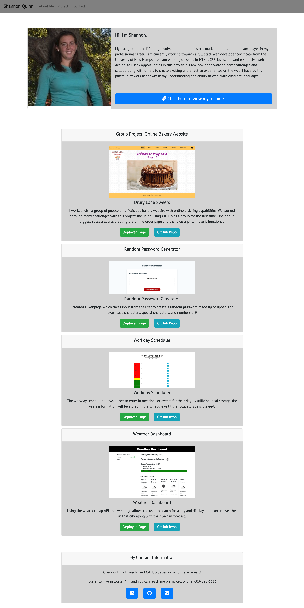

# Professional-Portfolio

11/13/2020:
After spending the last 8 weeks in the Coding Bootcamp, I have created a professional portfolio to showcase what I have learned and accomplished so far. I hope that this will help me when I start searching for jobs. As I continue to learn more and develop more skills, I will make updates to this porfolio to share with potential employers. 

Repo link: https://github.com/shannonquinn91/Professional-Portfolio
Deployed Page link: https://shannonquinn91.github.io/Professional-Portfolio/ 

